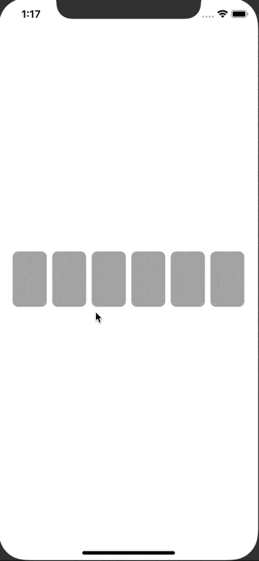

# PinCodeInputView
TextView for entering pin code. 




## Usage

```swift

// initialize
let pinCodeInputView: PinCodeInputView = .init(digit: 6)

view.addSubview(pinCodeInputView)

// set appearance
pinCodeInputView.set(
    appearance: .init(
        font: .systemFont(ofSize: 28, weight: .bold),
        textColor: .white,
        backgroundColor: .darkGray,
        cursorColor: .blue,
        cornerRadius: 8,
        spacing: 8
    )
)

// text handling
pinCodeInputView.set(changeTextHandler: { text in
    print(text)
})
```

## Installation

